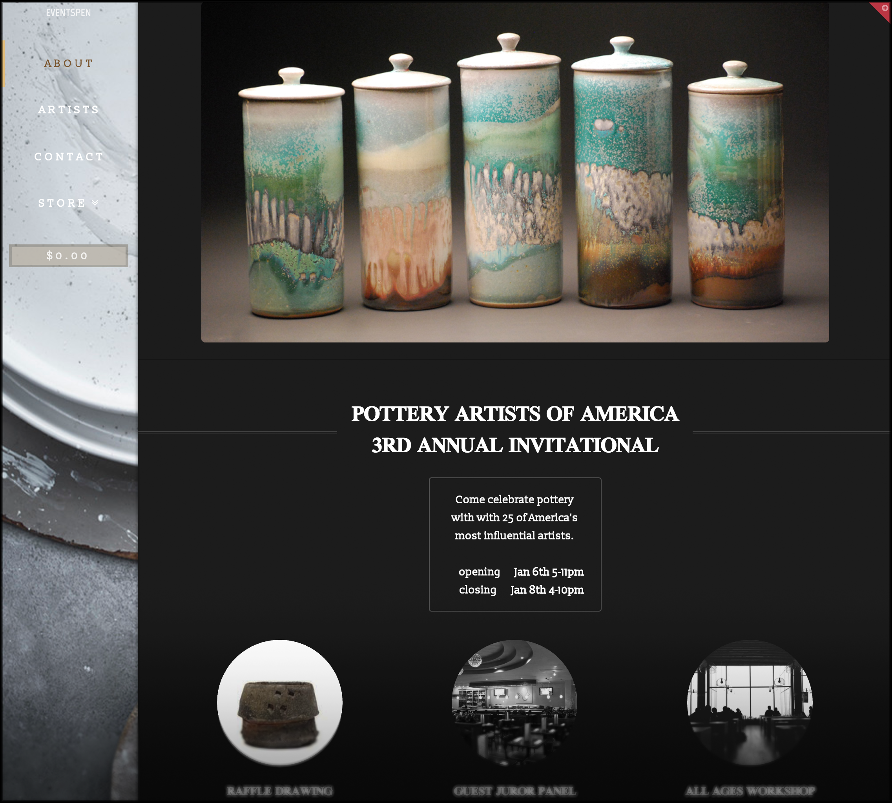

## **Events Pen**
---
#### // Epicodus Capstone Project 12.27.2016
---
---

by [Kyle Fisher](https://github.com/fisherkyle)

### **// Description**
---

EventsPen is a "Popup" E-Commerce website capable of offering turn-key hosting, sales, and curatorial services for clients. The site was created as the capstone project for Epicodus in Wordpress using X-Theme with modifications made within PHP and CSS for Google Maps API integration and custom stylization, respectively. Current content represents a mock-up of the variety of ways which a client's information, services, products, and other collateral is capable of being presented.

### **// Setup/Installation Requirements**
---

In your browser, navigate to www.eventspen.com. For editing, contact me using the information provided below.
### **// Support and contact details**
---

For comments, questions, or technical assistance, please send an email to kyle@kylefisher.com
___

### **// ~~Known Bugs~~**

___
### **// Technologies Used**
___
* PHP
* Wordpress
* XTheme
* GoogleMaps API
* Woo Commerce
* mySQL
* phpMyAdmin
* CSS
#
#

### **// License**
___

*MIT license*

___
___
*Copyright (c) 2016 [Kyle Fisher](https://github.com/fisherkyle)*
